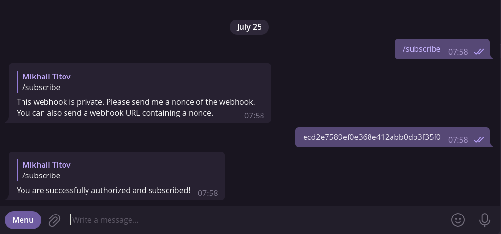
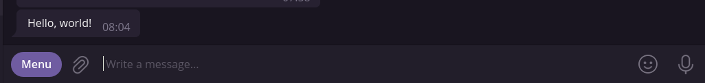

[](https://wakatime.com/badge/user/e4446807-0aa6-4ba9-92ea-2a7632bc44c9/project/72943875-a7a2-4579-8061-4c30602d6069)
[](https://opensource.org/licenses/Apache-2.0)
[](https://github.com/d1snin/webhooks-over-tgm/actions/workflows/gradle.yml)

### Webhooks over Telegram (WoT)

> ⚠ **This project is currently being migrated over the new stack. The main branch is completely unstable and which builds are, probably, even not working.**

WoT aims to provide a simple API for registering webhooks and sending messages to Telegram chats via them
using a single secret URL.
Just like in Discord or Slack. You simply `POST` a message to chats:

```http
POST https://wot.example.com/<nonce>
Content-Type: application/json
Authorization: auth token

{
  "content": {
    "sources": [
      {
        "type": "REGULAR",
        "value": "Hello, world!",
        "subsources": []
      }
    ]
  }
}
```

### Table of contents

- [Features](#Features)
- [Running](#Running)
- [Usage](#Usage)
- [Libraries](#Libraries)
- [License](#License)

### Features

- Easy-to-use RESTful API
- Simple [authorization](#Authorization)
- Simple subscribing and unsubscribing process
- Multiple webhooks support
- Formatting support
- Attachments support ***(WIP)***
- [Kotlin library for WoT](./wot-client)
- Spring Boot starter that autoconfigures the Kotlin library for WoT
- Automatic payload mapping from other services ***(WIP)***

### Running

To run the server you should have Java 17+ and Docker Compose installed.

Build the image:

```shell
./gradlew wot-server:bootBuildImage
```

Edit the `docker-compose.yml` file and configure the secret key used for authorization:

```yaml
# ./wot-server/docker/docker-compose.yml
# ...
services:
  # ...
  wot-server:
    # ...
    environment:
      # ...
      SIMPLE_SECURITY_AUTHENTICATION_SECRET: my_secret_key
      # ...
    # ...
  # ...
# ...
```

Run the containers:

```shell
docker-compose -f ./wot-server/docker/docker-compose.yml up -d
```

### Usage

Let's start with creating a webhook:

```http request
POST https://localhost:9696/api/webhooks
Content-Type: application/json
Authorization: ...

{
  "name": "my-webhook",
  "botToken": "your bot token",
  "private": true,
  "targets": []
}
```

Now open the Telegram bot with which the webhook is bound and send `/subscribe`.



Since this webhook is marked as `private`, we have to send its nonce which we got in the response.

Well, let's send a message now:

```http request
POST https://localhost:9696/<webhook nonce>
Content-Type: application/json

{
  "content": {
    "sources": [
      {
        "type": "REGULAR",
        "value": "Hello, world!",
        "subsources": []
      }
    ]
  }
}
```



#### Authorization

Each request to `/api/**` path must include a secret key within the `Authorization` header.
See [Running](#Running) for more info.

### Libraries

- [wot-client](https://github.com/d1s-utils/webhooks-over-tgm/tree/main/wot-client): WoT API client for Kotlin.

### License

```
   Copyright 2022 Webhooks over Telegram project contributors

   Licensed under the Apache License, Version 2.0 (the "License");
   you may not use this file except in compliance with the License.
   You may obtain a copy of the License at

       https://www.apache.org/licenses/LICENSE-2.0

   Unless required by applicable law or agreed to in writing, software
   distributed under the License is distributed on an "AS IS" BASIS,
   WITHOUT WARRANTIES OR CONDITIONS OF ANY KIND, either express or implied.
   See the License for the specific language governing permissions and
   limitations under the License.
```
